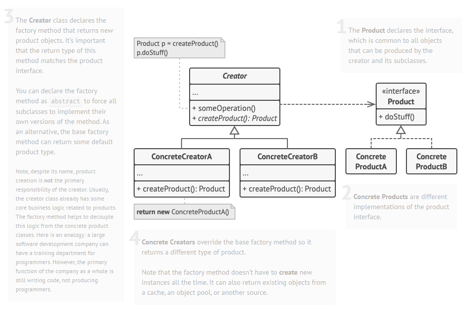

# Factory Method

[Source Material][def]

## Solution

The Factory Method pattern suggests that you replace direct object construction calls (using the new operator) with calls to a special factory method. Don’t worry: the objects are still created via the new operator, but it’s being called from within the factory method. Objects returned by a factory method are often referred to as products.

## Structure



## Pseudocode Button Dialog

```c#
// The creator class declares the factory method that must
// return an object of a product class. The creator's subclasses
// usually provide the implementation of this method.
class Dialog is
    // The creator may also provide some default implementation
    // of the factory method.
    abstract method createButton():Button

    // Note that, despite its name, the creator's primary
    // responsibility isn't creating products. It usually
    // contains some core business logic that relies on product
    // objects returned by the factory method. Subclasses can
    // indirectly change that business logic by overriding the
    // factory method and returning a different type of product
    // from it.
    method render() is
        // Call the factory method to create a product object.
        Button okButton = createButton()
        // Now use the product.
        okButton.onClick(closeDialog)
        okButton.render()


// Concrete creators override the factory method to change the
// resulting product's type.
class WindowsDialog extends Dialog is
    method createButton():Button is
        return new WindowsButton()

class WebDialog extends Dialog is
    method createButton():Button is
        return new HTMLButton()


// The product interface declares the operations that all
// concrete products must implement.
interface Button is
    method render()
    method onClick(f)

// Concrete products provide various implementations of the
// product interface.
class WindowsButton implements Button is
    method render(a, b) is
        // Render a button in Windows style.
    method onClick(f) is
        // Bind a native OS click event.

class HTMLButton implements Button is
    method render(a, b) is
        // Return an HTML representation of a button.
    method onClick(f) is
        // Bind a web browser click event.


class Application is
    field dialog: Dialog

    // The application picks a creator's type depending on the
    // current configuration or environment settings.
    method initialize() is
        config = readApplicationConfigFile()

        if (config.OS == "Windows") then
            dialog = new WindowsDialog()
        else if (config.OS == "Web") then
            dialog = new WebDialog()
        else
            throw new Exception("Error! Unknown operating system.")

    // The client code works with an instance of a concrete
    // creator, albeit through its base interface. As long as
    // the client keeps working with the creator via the base
    // interface, you can pass it any creator's subclass.
    method main() is
        this.initialize()
        dialog.render()
```

## Applicability

- Use the Factory Method when you don’t know beforehand the exact types and dependencies of the objects your code should work with.
    The Factory Method separates product construction code from the code that actually uses the product. Therefore it’s easier to extend the product construction code independently from the rest of the code.

    For example, to add a new product type to the app, you’ll only need to create a new creator subclass and override the factory method in it.
- Use the Factory Method when you want to provide users of your library or framework with a way to extend its internal components.
     Inheritance is probably the easiest way to extend the default behavior of a library or framework. But how would the framework recognize that your subclass should be used instead of a standard component?

    The solution is to reduce the code that constructs components across the framework into a single factory method and let anyone override this method in addition to extending the component itself.

    Let’s see how that would work. Imagine that you write an app using an open source UI framework. Your app should have round buttons, but the framework only provides square ones. You extend the standard Button class with a glorious RoundButton subclass. But now you need to tell the main UIFramework class to use the new button subclass instead of a default one.

    To achieve this, you create a subclass UIWithRoundButtons from a base framework class and override its createButton method. While this method returns Button objects in the base class, you make your subclass return RoundButton objects. Now use the UIWithRoundButtons class instead of UIFramework. And that’s about it!
- Use the Factory Method when you want to save system resources by reusing existing objects instead of rebuilding them each time.
    You often experience this need when dealing with large, resource-intensive objects such as database connections, file systems, and network resources.

    Let’s think about what has to be done to reuse an existing object:

    1. First, you need to create some storage to keep track of all of the created objects.
    When someone requests an object, the program should look for a free object inside that pool.
    … and then return it to the client code.
    If there are no free objects, the program should create a new one (and add it to the pool).
    That’s a lot of code! And it must all be put into a single place so that you don’t pollute the program with duplicate code.

    2. Probably the most obvious and convenient place where this code could be placed is the constructor of the class whose objects we’re trying to reuse. However, a constructor must always return new objects by definition. It can’t return existing instances.

    3. Therefore, you need to have a regular method capable of creating new objects as well as reusing existing ones. That sounds very much like a factory method.

    That’s a lot of code! And it must all be put into a single place so that you don’t pollute the program with duplicate code.

    Probably the most obvious and convenient place where this code could be placed is the constructor of the class whose objects we’re trying to reuse. However, a constructor must always return new objects by definition. It can’t return existing instances.

    Therefore, you need to have a regular method capable of creating new objects as well as reusing existing ones. That sounds very much like a factory method.

## How to Implement

1. Make all products follow the same interface. This interface should declare methods that make sense in every product.

2. Add an empty factory method inside the creator class. The return type of the method should match the common product interface.

3. In the creator’s code find all references to product constructors. One by one, replace them with calls to the factory method, while extracting the product creation code into the factory method.

    You might need to add a temporary parameter to the factory method to control the type of returned product.

    At this point, the code of the factory method may look pretty ugly. It may have a large switch statement that picks which product class to instantiate. But don’t worry, we’ll fix it soon enough.

4. Now, create a set of creator subclasses for each type of product listed in the factory method. Override the factory method in the subclasses and extract the appropriate bits of construction code from the base method.

5. If there are too many product types and it doesn’t make sense to create subclasses for all of them, you can reuse the control parameter from the base class in subclasses.

    For instance, imagine that you have the following hierarchy of classes: the base Mail class with a couple of subclasses: AirMail and GroundMail; the Transport classes are Plane, Truck and Train. While the AirMail class only uses Plane objects, GroundMail may work with both Truck and Train objects. You can create a new subclass (say TrainMail) to handle both cases, but there’s another option. The client code can pass an argument to the factory method of the GroundMail class to control which product it wants to receive.

6. If, after all of the extractions, the base factory method has become empty, you can make it abstract. If there’s something left, you can make it a default behavior of the method.

- Pros and Cons
    1. You avoid tight coupling between the creator and the concrete products.
    2. Single Responsibility Principle. You can move the product creation code into one place in the program, making the code easier to support.
    3. Open/Closed Principle. You can introduce new types of products into the program without breaking existing client code.

## Conceptual Example

```c#
using System;

namespace RefactoringGuru.DesignPatterns.FactoryMethod.Conceptual
{
    // The Creator class declares the factory method that is supposed to return
    // an object of a Product class. The Creator's subclasses usually provide
    // the implementation of this method.
    abstract class Creator
    {
        // Note that the Creator may also provide some default implementation of
        // the factory method.
        public abstract IProduct FactoryMethod();

        // Also note that, despite its name, the Creator's primary
        // responsibility is not creating products. Usually, it contains some
        // core business logic that relies on Product objects, returned by the
        // factory method. Subclasses can indirectly change that business logic
        // by overriding the factory method and returning a different type of
        // product from it.
        public string SomeOperation()
        {
            // Call the factory method to create a Product object.
            var product = FactoryMethod();
            // Now, use the product.
            var result = "Creator: The same creator's code has just worked with "
                + product.Operation();

            return result;
        }
    }

    // Concrete Creators override the factory method in order to change the
    // resulting product's type.
    class ConcreteCreator1 : Creator
    {
        // Note that the signature of the method still uses the abstract product
        // type, even though the concrete product is actually returned from the
        // method. This way the Creator can stay independent of concrete product
        // classes.
        public override IProduct FactoryMethod()
        {
            return new ConcreteProduct1();
        }
    }

    class ConcreteCreator2 : Creator
    {
        public override IProduct FactoryMethod()
        {
            return new ConcreteProduct2();
        }
    }

    // The Product interface declares the operations that all concrete products
    // must implement.
    public interface IProduct
    {
        string Operation();
    }

    // Concrete Products provide various implementations of the Product
    // interface.
    class ConcreteProduct1 : IProduct
    {
        public string Operation()
        {
            return "{Result of ConcreteProduct1}";
        }
    }

    class ConcreteProduct2 : IProduct
    {
        public string Operation()
        {
            return "{Result of ConcreteProduct2}";
        }
    }

    class Client
    {
        public void Main()
        {
            Console.WriteLine("App: Launched with the ConcreteCreator1.");
            ClientCode(new ConcreteCreator1());
            
            Console.WriteLine("");

            Console.WriteLine("App: Launched with the ConcreteCreator2.");
            ClientCode(new ConcreteCreator2());
        }

        // The client code works with an instance of a concrete creator, albeit
        // through its base interface. As long as the client keeps working with
        // the creator via the base interface, you can pass it any creator's
        // subclass.
        public void ClientCode(Creator creator)
        {
            // ...
            Console.WriteLine("Client: I'm not aware of the creator's class," +
                "but it still works.\n" + creator.SomeOperation());
            // ...
        }
    }

    class Program
    {
        static void Main(string[] args)
        {
            new Client().Main();
        }
    }
}
```

[def]: https://refactoring.guru/design-patterns/factory-method
